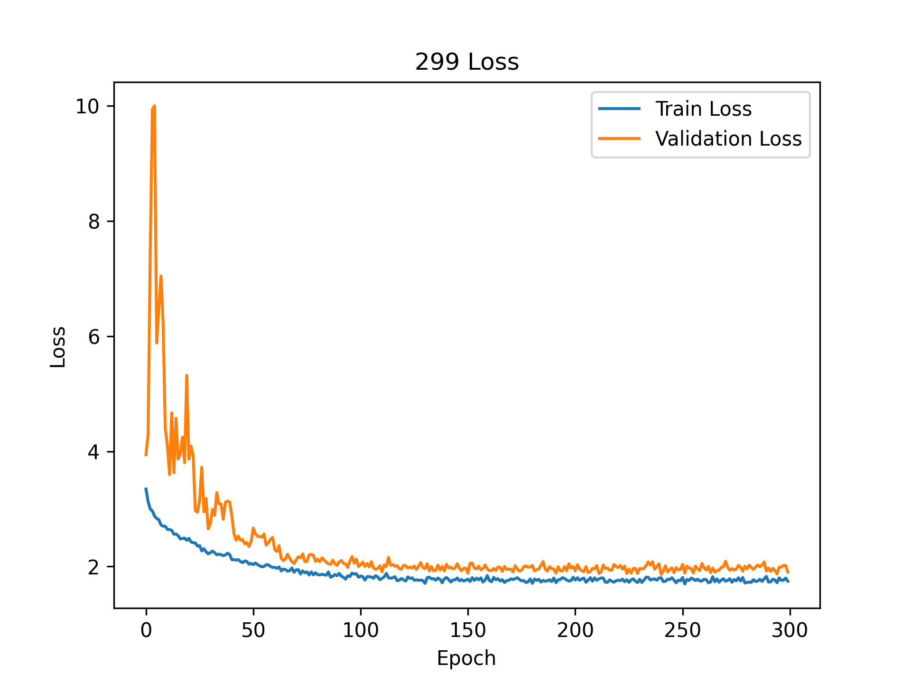
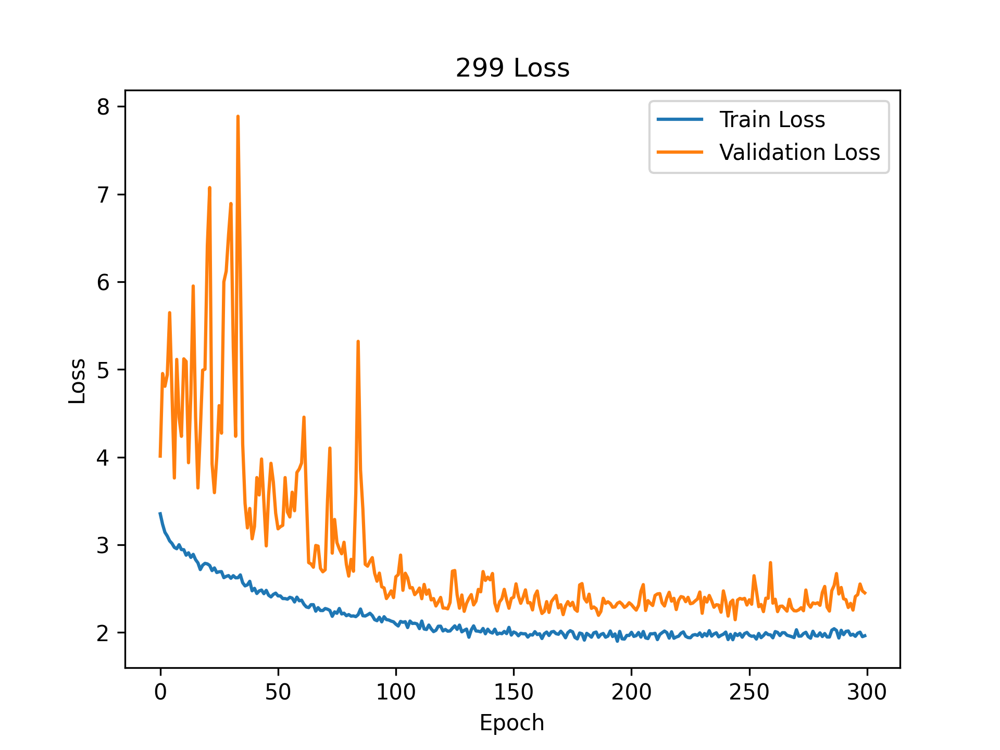
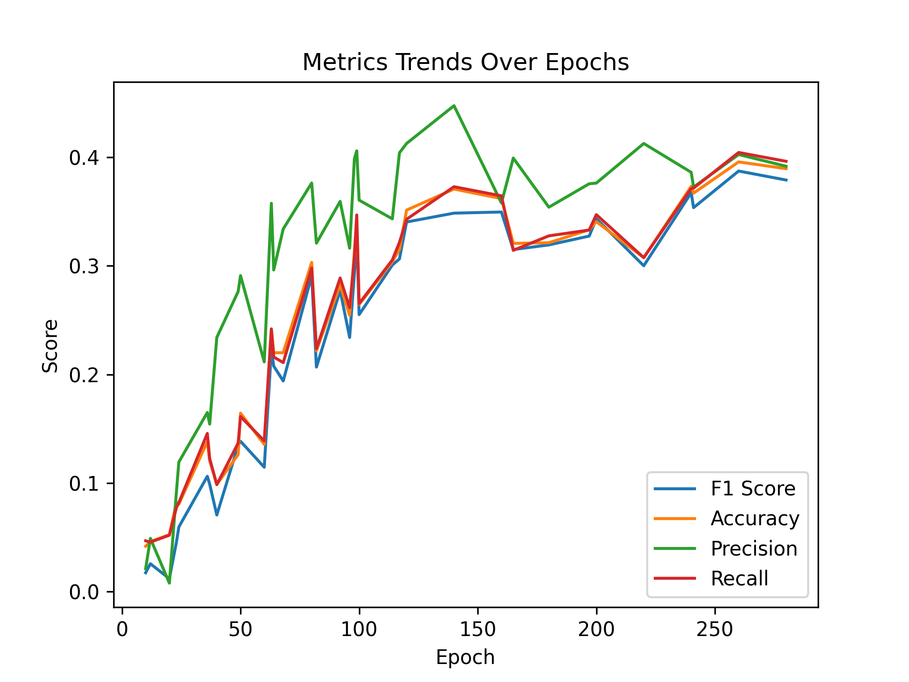

# 实验报告

## Noise Condition: std005_bias0_1

### Seed: experiment_seed_114514

#### Setup: sound-power

*Best Epoch*: 437

| F1 Score | Accuracy | Precision | Recall |
| --- | --- | --- | --- |
| 0.3445972507025138 | 0.355 | 0.38676190476190475 | 0.355 |

#### Setup: ideal-latent

*Best Epoch*: 151

| F1 Score | Accuracy | Precision | Recall |
| --- | --- | --- | --- |
| 0.71831746031746 | 0.73 | 0.7572467532467533 | 0.73 |

#### Setup: End-2-end

*Best Epoch*: 276

| F1 Score | Accuracy | Precision | Recall |
| --- | --- | --- | --- |
| 0.27223860350176143 | 0.295 | 0.3382712842712843 | 0.295 |

### Seed: experiment_seed_3047

#### Setup: sound-power

*Best Epoch*: 401

| F1 Score | Accuracy | Precision | Recall |
| --- | --- | --- | --- |
| 0.3645642135642136 | 0.365 | 0.4081428571428571 | 0.365 |

#### Setup: ideal-latent

*Best Epoch*: 231

| F1 Score | Accuracy | Precision | Recall |
| --- | --- | --- | --- |
| 0.6878138528138527 | 0.705 | 0.7075714285714285 | 0.705 |

#### Setup: air-propagate-latent

*Best Epoch*: 310

| F1 Score | Accuracy | Precision | Recall |
| --- | --- | --- | --- |
| 0.5105655046707678 | 0.535 | 0.5448571428571429 | 0.535 |

#### Setup: End-2-end

*Best Epoch*: 107

| F1 Score | Accuracy | Precision | Recall |
| --- | --- | --- | --- |
| 0.24856551683610506 | 0.275 | 0.26184134166487105 | 0.275 |

### Seed: experiment_seed_4999

#### Setup: sound-power

*Best Epoch*: 191

| F1 Score | Accuracy | Precision | Recall |
| --- | --- | --- | --- |
| 0.3244565761036349 | 0.34 | 0.36837057387057387 | 0.34 |

#### Setup: ideal-latent

*Best Epoch*: 250

| F1 Score | Accuracy | Precision | Recall |
| --- | --- | --- | --- |
| 0.7108414134884723 | 0.705 | 0.7847435897435898 | 0.705 |

#### Setup: air-propagate-latent

*Best Epoch*: 154

| F1 Score | Accuracy | Precision | Recall |
| --- | --- | --- | --- |
| 0.5418975468975469 | 0.555 | 0.5934155844155844 | 0.555 |

#### Setup: End-2-end

*Best Epoch*: 240

| F1 Score | Accuracy | Precision | Recall |
| --- | --- | --- | --- |
| 0.4082270774976656 | 0.42 | 0.5055201465201464 | 0.42 |

### Seed: experiment_seed_65536

#### Setup: sound-power

*Best Epoch*: 240

| F1 Score | Accuracy | Precision | Recall |
| --- | --- | --- | --- |
| 0.30997030747030746 | 0.335 | 0.35424999999999995 | 0.335 |

#### Setup: ideal-latent

*Best Epoch*: 144

| F1 Score | Accuracy | Precision | Recall |
| --- | --- | --- | --- |
| 0.6199036519036519 | 0.635 | 0.6768650793650793 | 0.635 |

#### Setup: air-propagate-latent

*Best Epoch*: 129

| F1 Score | Accuracy | Precision | Recall |
| --- | --- | --- | --- |
| 0.49020456667515494 | 0.515 | 0.5267690642690642 | 0.515 |

#### Setup: End-2-end

*Best Epoch*: 241

| F1 Score | Accuracy | Precision | Recall |
| --- | --- | --- | --- |
| 0.3019550040602672 | 0.325 | 0.3433679653679653 | 0.325 |

- std005_bias0_1 / End-2-end: 0.0718
- std005_bias0_1 / air-propagate-latent: 0.0267
- std005_bias0_1 / ideal-latent: 0.0435
- std005_bias0_1 / sound-power: 0.0239
