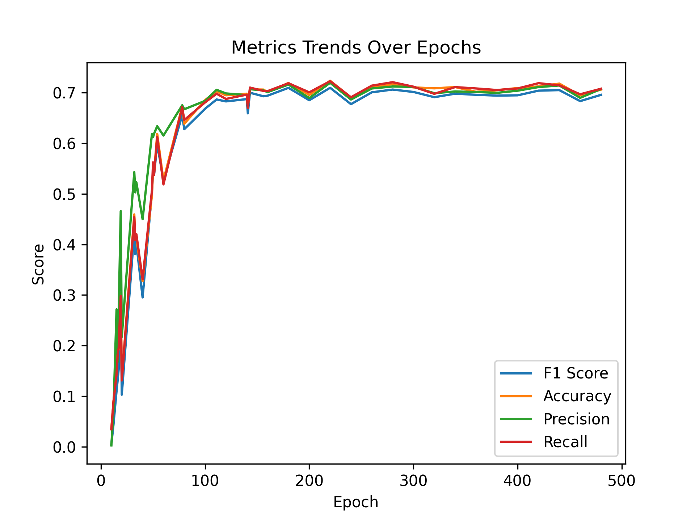
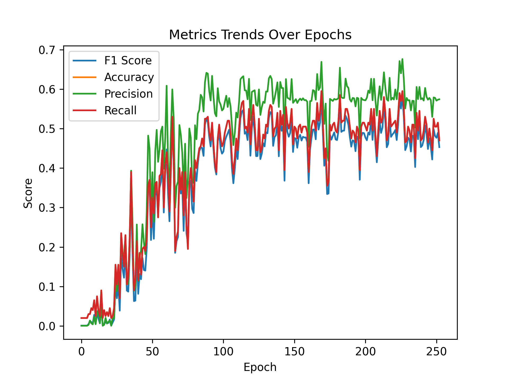
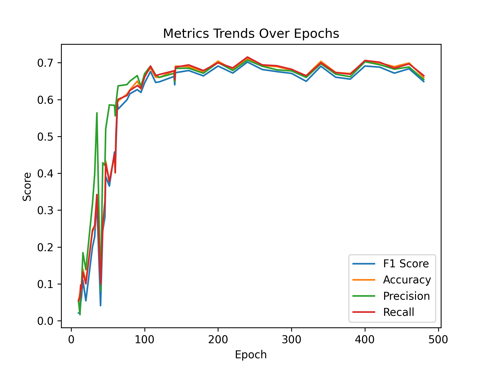
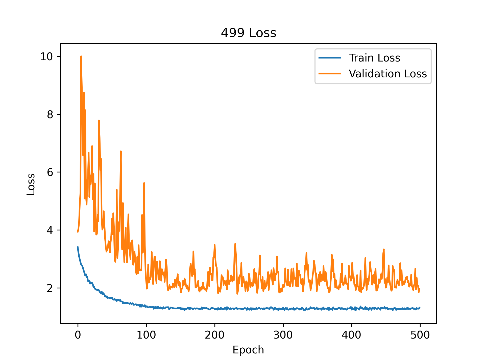

# 实验报告

## Noise Condition: std0_bias0

### Seed: experiment_seed_114514

#### Setup: sound-power

*Best Epoch*: 374

| F1 Score | Accuracy | Precision | Recall |
| --- | --- | --- | --- |
| 0.40975901875901877 | 0.43 | 0.4480793650793651 | 0.43 |

#### Setup: air-propagate-latent

*Best Epoch*: 156

| F1 Score | Accuracy | Precision | Recall |
| --- | --- | --- | --- |
| 0.6520753690753689 | 0.67 | 0.6942568542568543 | 0.67 |

#### Setup: End-2-end

*Best Epoch*: 252

| F1 Score | Accuracy | Precision | Recall |
| --- | --- | --- | --- |
| 0.38794851008263564 | 0.42 | 0.44460877684407096 | 0.42 |

### Seed: experiment_seed_3047

#### Setup: sound-power

*Best Epoch*: 407

| F1 Score | Accuracy | Precision | Recall |
| --- | --- | --- | --- |
| 0.4014676048589092 | 0.425 | 0.4373830409356725 | 0.425 |

#### Setup: air-propagate-latent

*Best Epoch*: 142

| F1 Score | Accuracy | Precision | Recall |
| --- | --- | --- | --- |
| 0.634996003996004 | 0.65 | 0.6649841269841269 | 0.65 |

#### Setup: End-2-end

*Best Epoch*: 233

| F1 Score | Accuracy | Precision | Recall |
| --- | --- | --- | --- |
| 0.52899555999556 | 0.525 | 0.6032142857142857 | 0.525 |

### Seed: experiment_seed_4999

#### Setup: sound-power

*Best Epoch*: 140

| F1 Score | Accuracy | Precision | Recall |
| --- | --- | --- | --- |
| 0.40924819624819625 | 0.43 | 0.4718333333333334 | 0.43 |

#### Setup: air-propagate-latent

*Best Epoch*: 142

| F1 Score | Accuracy | Precision | Recall |
| --- | --- | --- | --- |
| 0.6673842823842823 | 0.675 | 0.7273174603174604 | 0.675 |

#### Setup: End-2-end

*Best Epoch*: 81

| F1 Score | Accuracy | Precision | Recall |
| --- | --- | --- | --- |
| 0.5223818403818404 | 0.515 | 0.6614573875527222 | 0.515 |

### Seed: experiment_seed_65536

#### Setup: sound-power

*Best Epoch*: 230

| F1 Score | Accuracy | Precision | Recall |
| --- | --- | --- | --- |
| 0.36974675324675316 | 0.385 | 0.4091428571428571 | 0.385 |

#### Setup: air-propagate-latent

*Best Epoch*: 186

| F1 Score | Accuracy | Precision | Recall |
| --- | --- | --- | --- |
| 0.6608498168498168 | 0.665 | 0.7546363636363637 | 0.665 |

#### Setup: End-2-end

*Best Epoch*: 278

| F1 Score | Accuracy | Precision | Recall |
| --- | --- | --- | --- |
| 0.5468296148296149 | 0.56 | 0.6432662337662337 | 0.56 |

- std0_bias0 / End-2-end: 0.0771
- std0_bias0 / air-propagate-latent: 0.0299
- std0_bias0 / sound-power: 0.0256
