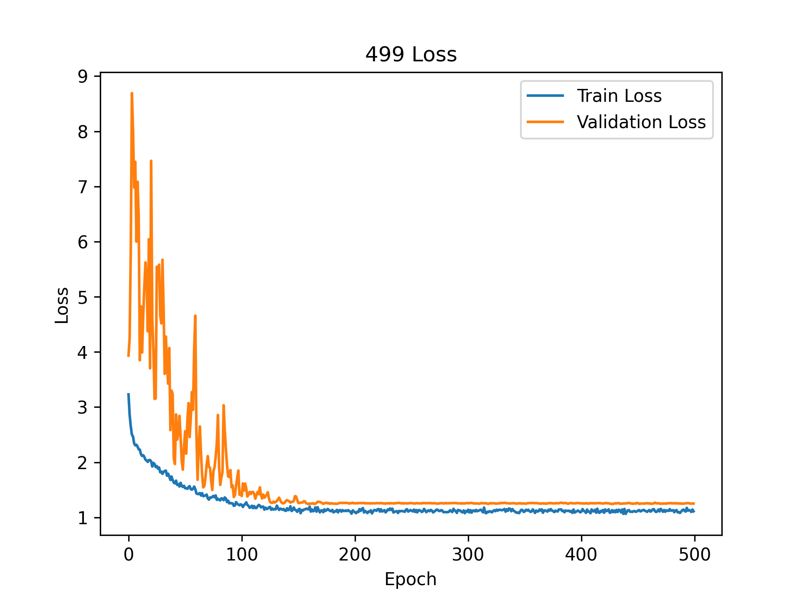
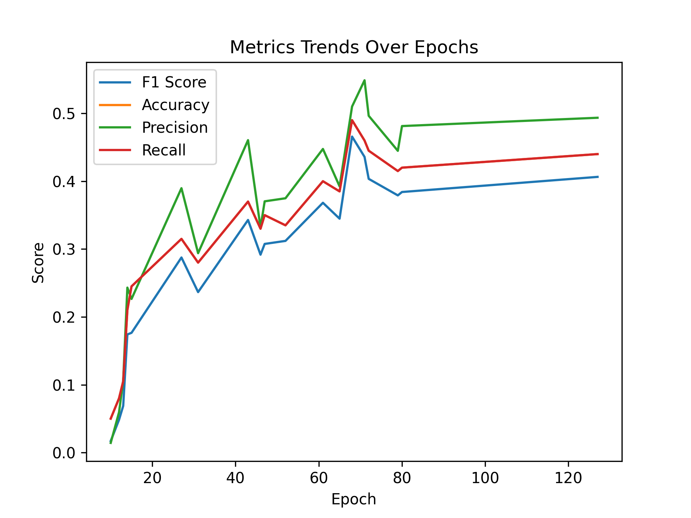

# 实验报告

## Noise Condition: std0_bias0_1

### Seed: experiment_seed_114514

#### Setup: sound-power

*Best Epoch*: 324

| F1 Score | Accuracy | Precision | Recall |
| --- | --- | --- | --- |
| 0.36548773448773453 | 0.4 | 0.3849189144189144 | 0.4 |

#### Setup: air-propagate-latent

*Best Epoch*: 126

| F1 Score | Accuracy | Precision | Recall |
| --- | --- | --- | --- |
| 0.6813268953268953 | 0.695 | 0.724920634920635 | 0.695 |

#### Setup: End-2-end

*Best Epoch*: 272

| F1 Score | Accuracy | Precision | Recall |
| --- | --- | --- | --- |
| 0.15519788013405036 | 0.22 | 0.17059814872549303 | 0.22 |

### Seed: experiment_seed_3047

#### Setup: sound-power

*Best Epoch*: 445

| F1 Score | Accuracy | Precision | Recall |
| --- | --- | --- | --- |
| 0.3603308913308913 | 0.39 | 0.39125685425685425 | 0.39 |

#### Setup: air-propagate-latent

*Best Epoch*: 176

| F1 Score | Accuracy | Precision | Recall |
| --- | --- | --- | --- |
| 0.6596704406704406 | 0.675 | 0.7084660894660896 | 0.675 |

#### Setup: End-2-end

*Best Epoch*: 285

| F1 Score | Accuracy | Precision | Recall |
| --- | --- | --- | --- |
| 0.1827167317777074 | 0.205 | 0.26514521111072836 | 0.205 |

### Seed: experiment_seed_65536

#### Setup: sound-power

*Best Epoch*: 445

| F1 Score | Accuracy | Precision | Recall |
| --- | --- | --- | --- |
| 0.3257132867132867 | 0.36 | 0.34300793650793643 | 0.36 |

#### Setup: air-propagate-latent

*Best Epoch*: 131

| F1 Score | Accuracy | Precision | Recall |
| --- | --- | --- | --- |
| 0.6678932178932178 | 0.68 | 0.724969696969697 | 0.68 |

#### Setup: End-2-end

*Best Epoch*: 127

| F1 Score | Accuracy | Precision | Recall |
| --- | --- | --- | --- |
| 0.40638600288600296 | 0.44 | 0.4935432527242872 | 0.44 |

- std0_bias0_1 / End-2-end: 0.1237
- std0_bias0_1 / air-propagate-latent: 0.0212
- std0_bias0_1 / sound-power: 0.0237
